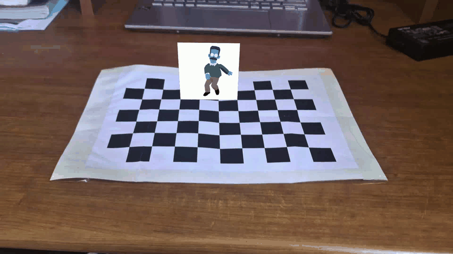

# Ned Flanders on the Chessboard: AR Overlay

This project implements an Augmented Reality (AR) pipeline that detects a chessboard in a video, estimates the camera's pose, and overlays an animated Ned Flanders GIF onto the board in perspective.



## Overview
The goal of this project is to create a seamless AR experience where an animated character appears to "stand" on a real-world chessboard. The pipeline uses classical computer vision techniques to estimate the 3D position and orientation (pose) of the camera relative to the board, allowing for accurate perspective warping of the AR content.

## Robust Workflow for HW4
For high-quality pose estimation, this project separates **Camera Calibration** from the **AR Overlay** process.

1.  **Calibration (Prerequisite)**: Use dedicated calibration videos to compute your camera's intrinsic parameters. This step ensures that pose estimation is accurate and stable.
2.  **AR Overlay**: Once calibrated, the main script reuses the saved calibration data to perform real-time (or offline) pose estimation and AR rendering.

## Features
- **Robust Calibration Pipeline**: Includes blur filtering (Laplacian variance), redundancy rejection, and comprehensive reprojection diagnostics.
- **Resolution Scaling**: Automatically scales the camera matrix (K) if the AR video resolution differs from the calibration resolution, provided the aspect ratio remains consistent.
- **High-Precision Detection**: Uses `findChessboardCornersSB` (Symmetry-Based) and `cornerSubPix` for superior corner localization.
- **Perspective AR Overlay**: Warps animated GIF frames into the chessboard's perspective with full alpha transparency support.

## How to Run

### 1. Calibration
To generate a new calibration file using videos from the `raw/` folder:
```bash
python calibration.py --vids raw/vid1.mp4 raw/vid2.mp4 --pattern 9 6 --size 25.0
```
*Note: Ensure the `--pattern` matches the internal corners of your chessboard (e.g., 9x6).*

### 2. AR Overlay
Run the main script using the precomputed calibration:
```bash
python main.py --input_video example.mp4 --calibration outputs/calibration/calibration_result.json
```

## Results & Demo
The final processed video is saved as `output.mp4`. You can find visual results in the following files:
- `assets/demoGif.gif`: A short animated preview of the AR overlay.
- `assets/result_frame.png`: A high-quality screenshot of Ned Flanders on the board.
- `output.mp4`: The complete rendered AR experience.

> **Note on GIF Color**: The colors of Ned Flanders in `assets/demoGif.gif` might not look exactly the same as in the original video. This is because the GIF format is limited to a **256-color palette**, which leads to color quantization during the conversion from video. To see the original rendering quality and colors, please refer directly to the `output.mp4` file.

## Project Structure
- `main.py`: The AR pipeline that reuses calibration for pose estimation.
- `calibration.py`: Robust utility to generate `calibration_result.json`.
- `example.mp4`: Default input video containing the chessboard.
- `nedFlanders.gif`: The animated character used for the overlay.
- `output.mp4`: Final rendered AR output.
- `outputs/calibration/`: Contains JSON results, Markdown reports, and error CSVs.
- `assets/`: Folder containing demo media for documentation.

## Requirements
- Python 3.10+
- `opencv-python`, `numpy`, `imageio`

## How It Works
- **Calibration**: Samples frames throughout the calibration videos, filtering out blurry or redundant detections to obtain a high-quality set of points for `cv.calibrateCamera`.
- **Pose Estimation**: Uses `cv.solvePnP` with fixed calibration parameters to find the camera's rotation and translation in every frame.
- **Perspective Warp**: Projects a 3D model of a vertical plane onto the board and computes a perspective transformation to warp the GIF frames into the scene.

